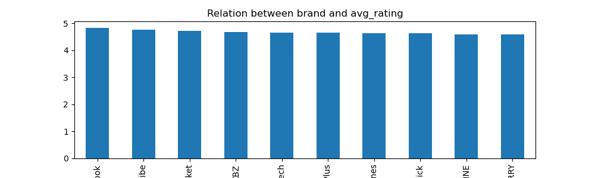
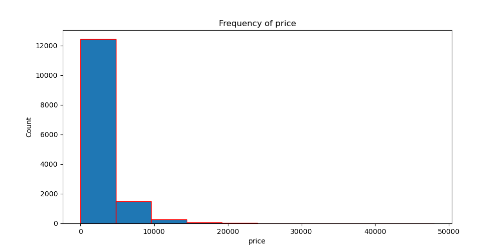
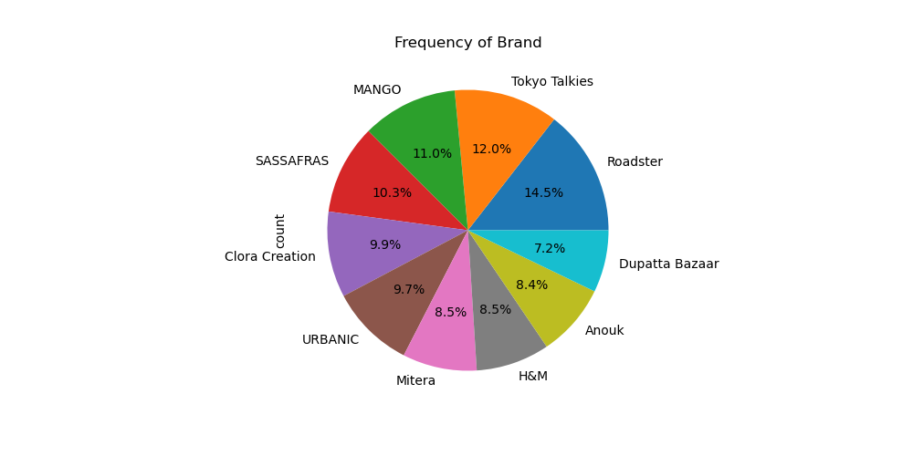
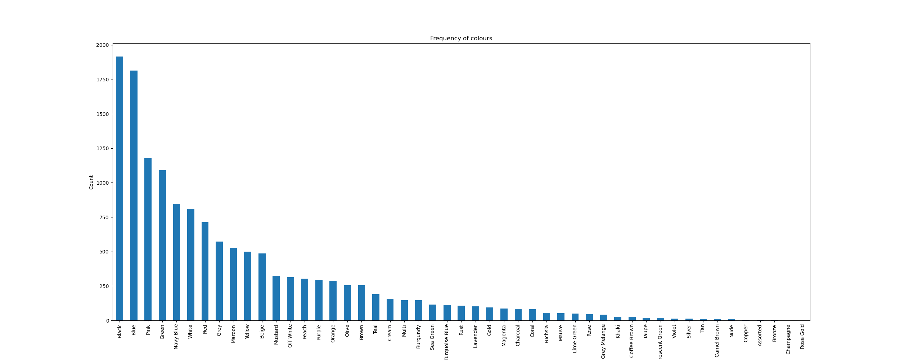

# Myntra Fashion Product Analysis

## Project Overview
This project analyzes Myntra fashion product data to understand
pricing patterns, brand distribution and product ratings.

## Tools Used
Python
Pandas
Matplotlib
Seaborn

## Analysis Performed
- Data cleaning and preprocessing
- Exploratory Data Analysis (EDA)
- Price distribution analysis
- Brand popularity analysis
- Rating distribution analysis

## Key Insights
- Certain brands dominate product listings
- Discounted products tend to receive higher ratings
- Mid-range priced products are most common

## Visualizations

### Brand vs Average Rating

### Price Distribution

### Brand Frequency

### Colour Distribution

